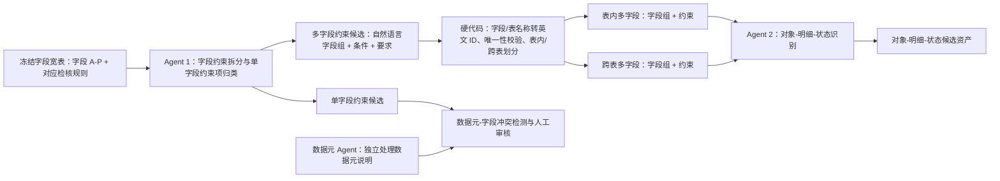

# EAST 约束资产 V1：字段、多字段与对象-明细-状态通路交接

> 更新日期：2026-08-02  
> 目的：供下一会话继续约束资产 V1 构建。本文记录已经达成的方案、已有试跑成果、不可沿用的偏差，以及下一步应先做什么。  
> 状态：**方案已明确，尚未发布任何可供 000 运行的约束资产。**

## 1. 新会话启动顺序

进入实现前，依次阅读：

1. `AGENTS.md`
2. `docs/codex_east_experience_memory.md`
3. `结构图/EAST数据集大图-V5.drawio`
4. `结构图/agent划分与任务输入输出清单-V2.xlsx`
5. `结构图/V5项目上下文总览.md`
6. `kb/working/20260727_000_goal_mode_v1/目标模式设计/000目标目录与SQLite概念模型-V1.xlsx`
7. 本文。

发生冲突时，以本文第 5 节至第 9 节的最新确认方案为准；它专门修正了此前第 03 阶段的错误实现方向。所有产物先留在 `kb/working/` 过程层，不能修改旧 KB 或把候选资产直接当作 000 的运行期资产。

## 2. 总目标与边界

### 2.1 总目标

从 `data/raw/20260626_east_materials/east材料/` 的原始 EAST 材料构建可追溯、可审核、可供 `000-资产检索agent` 精准查询的 V1 约束资产库。最终支撑后续：

- EAST 可观察事实映射；
- 结构闭包构造；
- 单字段、表内多字段、跨表多字段硬编码校验模块；
- 对象-明细-状态模块；
- 000 的字段解释、约束、码表、编码方式与关系查询。

### 2.2 V1 来源边界

| 来源 | V1 用途 | 处理原则 |
| --- | --- | --- |
| 规范附件 3：数据元说明 | 数据元的格式、编码、码值、默认值等可复用规则 | 一条数据元一条 DeepSeek 任务 |
| 规范附件 3：数据结构 | 74 表、1963 字段主数据；字段备注中的字段/多字段规则 | 一条字段一条 DeepSeek 任务 |
| 规范附件 4：检核规则 | 当前检核规则的字段、多字段、关系证据 | 与字段宽表中的对应字段切片一并输入 |
| 规范附件 2 | 默认值、隐私/脱敏和真正影响 SQLite 数据内容的全局规则 | 作为内部可复用资产；不保留仅面向报送文本文件的分隔符等规则 |
| 规范附件 4：业务代码表 | 正式码表、码值、字段绑定 | 作为内部可复用资产；字段资产引用它 |
| EAST 模型、外部权威资料 | 仅辅助对象-明细-状态推断 | 必须标为派生证据，不能伪装为监管原文 |
| 四期答疑 | 本轮不进入约束资产 | 保留来源和延期记录；LLM 未通过的答疑不进入待审、更不进入资产 |
| CoreBank、组织树、科目树 | 不进入 V1 | 000 应明确返回“本版本未发布” |

附件 3 是 74 张表、1963 个字段、301 个数据元的主骨架。附件 4 中已识别的 134 条旧版字段未映射规则只留证据，状态为 `LEGACY_FIELD_EXCLUDED`，不得生效。

### 2.3 V1 对外与内部资产

000 最终对外暴露四类资产：

1. 单字段约束资产；
2. 表内多字段约束资产；
3. 跨表多字段约束资产；
4. 对象-明细-状态资产。

内部复用、由单字段资产显式引用但不作为独立模块的资产：

- 数据元约束资产；
- 码表与码值资产；
- 隐私/脱敏与全局规则资产。

数据元约束可被 000 查询、可被结构闭包带入，但不会产生“数据元模块”。单字段模块只消费单字段资产及其内部引用。

## 3. 约束项与基本粒度

### 3.1 单字段和数据元约束项

结构化约束项固定为：

`FORMAT`、`ENCODING_RULE`、`CODE_DOMAIN`、`DEFAULT_VALUE`、`FORBIDDEN_VALUE`、`VALUE_RANGE`、`NULLABLE`、`UNIQUE`、`PRIMARY_KEY`、`STRING_LENGTH`、`NUMERIC_PRECISION`、`PRIVACY_TRANSFORM`、`OTHER`。

其中：

- `NULLABLE=YES` 表示可以为空，`NO` 表示不允许为空，`UNSPECIFIED` 表示原文未规定；
- 字符串长度使用 `EXACT`、`MIN`、`MAX`、`RANGE`，不把所有长度压为一个数字；
- 数值精度独立保存总精度、整数位、小数位；
- 金融许可证号等复杂编码规则进入 `ENCODING_RULE`，不能被简化成日期格式示例；
- “其他”仅用于原文明确、但暂时不属于既定约束项的内容，必须带原文和原因。

数据元与单字段资产均是“无其他字段条件”的约束。一个字段引用其数据元资产，而不是复制一套相同规则。

### 3.2 多字段约束项与存储粒度

多字段资产按 **字段组 + 一条约束** 存储。字段组是参与该条事实的标准字段集合；约束本体保留自然语言的条件和要求，不在资产阶段改写成数学公式、SQL 或模块代码。

多字段允许的约束项为：`NULLABLE`、`FORBIDDEN_VALUE`、`VALUE_RANGE`、`REFERENCE_EXISTENCE`、`COMPARISON`、`OTHER`。每条额外保存：

- `condition_type`：`ALWAYS`、`WHEN`、`REFERENCE`、`COMPARISON`、`OTHER`；
- `condition_text`：原文条件；
- `requirement_text`：原文要求；
- 全部参与字段及其角色；
- 精确原文、来源文件哈希、Sheet/行/单元格定位。

范围只由参与字段所属表决定：字段组只落在一张表时为表内多字段；涉及两张及以上表时为跨表多字段。`REFERENCE_EXISTENCE` 表示监管口径上的引用/存在性一致，不自动称为数据库物理外键。

## 4. 硬代码与 LLM 的固定边界

### 4.1 LLM 做什么

DeepSeek 是受控的长文本结构化劳动力，只能基于提供的 EAST 原文：

- 解析一个数据元说明为数据元约束项；
- 在一个字段的字段材料中，拆出单字段约束和多字段约束；
- 把单字段约束落到固定约束项；
- 对已经被硬代码映射为标准字段组的多字段约束，识别它是否可形成对象-明细-状态关系。

每次都必须返回固定 JSON、固定码值、任务 ID、逐条 `source_refs`、原文摘录和不确定结论。LLM 不能生成事实来源、不能用常识补字段、不能直接写 SQLite 的已发布资产。

### 4.2 硬代码做什么

硬代码不做业务语义猜测，只做确定性工作：

- 冻结件哈希、输入切片、JSON Schema、枚举、来源引用和任务 ID 校验；
- 数据元/字段同一约束项的直接冲突识别；
- 将 LLM 提到的表名、字段名或英文码精确/唯一映射为 `表代码.字段代码`；
- 根据映射结果判定表内或跨表；
- 检查长度、范围和默认值等显式内部矛盾；
- 生成稳定 ID、去重、来源去向台账、人工审核项、覆盖报告；
- 为 000 装配只读 SQLite 视图和参数化查询。

无法唯一映射、来源未引用、结构不合法、字段不存在、模型明确不确定，均进入人工审核。禁止模糊匹配后自动入库。

## 5. 已确认的两 Agent 通路

这两 Agent 之间必须有硬代码翻译层。这里的“Agent”是职责边界，不要求立刻建设完整的长期运行服务；初期可以由可复现的任务编译器、批量调用脚本和固定 JSON 合同实现。



### 5.1 数据元通路：独立且先行

输入是附件 3“数据元说明”中一个数据元的编码、中文名、英文名、格式、数据元说明和精确定位。DeepSeek 逐条输出数据元约束项。

数据元通路不输出字段级主键、唯一性、表内/跨表关系，也不替代字段通路。其输出将由硬代码与后续字段的同约束项比对：当某字段的字段级明确值与其所属数据元的明确值不同，产生冲突候选，默认人工裁决优先级为：**数据结构 > 检核规则 > 数据元**。

### 5.2 Agent 1：字段约束拆分与单字段约束项归类

**任务名称建议：** `字段约束拆分与单字段约束项归类agent`。

**一条任务的输入：**

- 当前字段的表代码、表中文名、字段代码、字段中文名、字段序号、格式、备注等 A-P 信息；
- 当前字段在 Q-AE 槽位中对应的每条“检核规则编号 + 报送要求的定义描述 + 精确来源定位”；
- 当前字段的全部原始证据编号；
- 固定约束项枚举和 JSON Schema。

**明确不输入：**

- K 列数据元说明原文；
- 数据元 Agent 的结构化输出；
- 74 张表、1963 字段的全量 Schema；
- 外部常识、未经定位的答疑或猜测性字段映射。

不输入数据元输出是已确认决定：数据元和字段的结构化格式相近，后续由硬代码比较同字段的同约束项是否冲突，避免把两条来源通路混为一条 LLM 推理链。

**一条任务的输出分为两部分：**

1. `single_field_constraints`：只涉及当前字段的结构化约束项，例如格式、长度、是否可空、唯一性、主键、码值、默认值、禁止值、范围、隐私或其他；
2. `multi_field_constraints`：从当前字段证据中拆出的多字段候选。每条必须给出：
   - 原文支持的参与字段提及；
   - 当前字段在该约束中的角色；
   - 其他字段提及可以是中文名、表名+字段名或英文码，但不得编造；
   - 约束项；
   - 条件类型、条件文本、要求文本；
   - 原文摘录和 `source_refs`；
   - `UNRESOLVED` 或 `OTHER` 的明确原因。

Agent 1 负责“从字段材料中把多字段事实拆出来”，不是新增一条独立的多字段源材料通路。它的多字段输出仍是候选，尚未判断表内或跨表。

### 5.3 中间硬代码层：标准化与范围归类

对 Agent 1 输出的每一条多字段候选：

1. 将当前字段和其他字段提及翻译为标准 `表代码.字段代码`；
2. 映射必须精确且唯一。存在多个候选、原文不充分或没有字段时，写入 `FIELD_MAPPING_REVIEW`；
3. 字段组的标准字段全部属于同一张表时，形成“表内多字段：字段组 + 约束”；涉及多张表时，形成“跨表多字段：字段组 + 约束”；
4. 保留原始多字段候选、映射过程、映射依据和稳定 `atomic_multifield_rule_id`；
5. 相同事实可能从多个字段的任务中被拆出，硬代码依据参与字段集合、约束项、条件、要求和来源进行候选聚合，但不得抹掉多个来源引用。

这里无需每次把完整 Schema 塞给 LLM：完整 Schema 是硬代码的确定性索引。若将来需要二次澄清，只向 LLM 给出该自然语言提及的有限候选列表与证据，不让它在全库自由猜测。

### 5.4 Agent 2：对象-明细-状态识别

**任务名称建议：** `对象-明细-状态约束识别agent`。

它接收硬代码已经成功映射、已划分为表内或跨表的**一条字段组 + 约束**，一次处理一个原子多字段规则。它不从全库直接猜对象/明细/状态。

**输入：**

- `atomic_multifield_rule_id`；
- 表内或跨表范围；
- 标准字段组：表代码、表中文名、字段代码、字段中文名、字段格式、字段备注的必要切片；
- 该条多字段约束的约束项、条件、要求、原文摘录和全部 `source_refs`；
- 参与表的主键/唯一性已知事实及必要的表解释；
- 可选的 EAST 模型或外部权威辅助证据，必须单独标识为派生来源。

**输出：**

- `ods_classification`：`DETAIL_TO_STATE`、`OBJECT_STATE_BOUNDARY`、`STATE_RECONCILIATION`、`NOT_ODS`、`UNRESOLVED`；
- 若为 ODS：对象字段组、明细字段组、状态字段组及每个角色的证据；
- 与原多字段约束共用的 `atomic_multifield_rule_id`；
- 原文证据、派生证据、置信说明、不确定原因；
- **不输出** ORM、SQL、公式、模块代码或最终 `READ/CHECK/INSERT/UPDATE` 操作顺序。

对象-明细-状态识别覆盖表内和跨表多字段约束。不能只扫描“4 业务类-数值比较类”，但该类是优先试点来源；其余检核类型和字段备注中也可能含 ODS 线索。

建议的判断纪律：

- “交易金额 <= 账户余额”这类带交易/明细与余额/状态的关系，可判为 `DETAIL_TO_STATE`，但对象字段应有主键、账户标识或表语义证据；
- “集团已用额度 <= 集团授信额度”这类围绕同一对象边界的关系，可判为 `OBJECT_STATE_BOUNDARY`；
- “当前授信余额 = 当前授信额度 - 透支金额”这类状态之间的平衡关系，可判为 `STATE_RECONCILIATION`，不能因为有等式就强行虚构明细；
- 仅有 A+B=C、但缺少对象、明细或状态角色证据时，先为 `NOT_ODS` 或 `UNRESOLVED`；多字段约束本身仍保留；
- 监管原文只能证明关系约束时，最终业务事件的 `READ/CHECK/INSERT/UPDATE` 顺序要在后续 252 模块设计阶段另行派生、单独审核，不能被冒充为原文规则。

用户已点名的可优先试点来源包括 `JHGZ3653`、`JHGZ3639`、`JHGZ3798`。它们用于检验 Agent 2 是否能区分“明细对状态”“对象边界”“状态平衡”，而不是把所有数值比较规则塞成一种 ODS 关系。

## 6. 审核、状态和人工队列

### 6.1 本轮已确认的审核边界

- 数据元提取、Agent 1 字段拆分、Agent 2 ODS 识别：DeepSeek 输出 + 固定 JSON 校验 + 硬代码校验 + 代表性人工抽样；
- DeepSeek 失败三次、JSON 不合法、来源无法定位、字段映射不唯一、数据元/字段同项冲突、`OTHER`、`UNRESOLVED`：进入有明确问题的人工审核队列；
- **GLM 不是当前字段、多字段资产通路的既定审批环节。**此前已运行的 GLM 多字段审核只作为试验留档，不能作为批准、拒绝或人工审核的正式依据；
- 四期答疑不纳入本轮待审。它要么在未来独立版本中解析，要么不参与 V1。

### 6.2 人工审核项必须问清楚什么

人工审核不能只抛出原文。每条队列至少要包含：

- 要裁决的具体约束项或字段映射；
- 当前候选值 A、候选值 B（若为冲突）；
- 来源优先级和精确原文；
- 系统建议以及建议理由；
- 人工可选动作：采纳 A、采纳 B、合并、拒绝、补充字段映射、标为不适用；
- 裁决理由、裁决人、时间和影响的资产 ID。

### 6.3 状态

过程层可使用 `CANDIDATE`、`CONFLICT_CANDIDATE`、`PENDING_REVIEW`、`APPROVED`、`REJECTED`。只有来源完整、字段有效、冲突已裁决、所需审核通过的记录可转 `APPROVED`。任何含待审项的版本都不得标为 `ready_for_downstream`。

## 7. 当前已经完成的工作与可复用成果

### 7.1 已完成且可复用

| 工作 | 结果 | 主要位置 |
| --- | --- | --- |
| 原始来源冻结和哈希 | 已建立来源文件哈希、内容单元台账、来源到 000 目标映射 | `kb/working/20260727_000_goal_mode_v1/来源冻结层/` |
| 字段宽表冻结 | 1963 字段的 `目标`、`目标（编号）` 及检核规则槽位已冻结 | `来源冻结层/目标模式输入冻结-V1/` |
| 附件 2/3 机械解析 | 主数据、复杂编码/码值候选、附件 2 全局规则候选已整理 | `构建过程层/01_附件3主数据与附件2技术规则解析/` |
| 代码表/隐私支持资产导入 | 7 个码表域、5515 条码值、112 个字段码表绑定、13 条全局规则、56 条隐私引用；来源哈希已核对 | `03_约束资产目标模式提取/支持资产导入报告-V1.json` |
| 任务编译和 DeepSeek 调用基础设施 | 一数据元一任务、一字段一任务、请求/响应缓存、固定 JSON 校验、重试与来源校验 | `vnext/constraint_assets_v1/` |
| 数据元试跑 | 301/301 个任务成功 | `模型响应/DeepSeek批量运行报告-data_element.json` |
| 字段试跑 | 1963/1963 个任务成功 | `模型响应/DeepSeek批量运行报告-field.json` |
| 来源去向覆盖 | 6124 条来源记录中，5945 条候选、45 条待审、134 条旧版排除；有效任务输入未引用数为 0 | `来源去向覆盖报告-字段主通路-V1.json` |
| 单元测试 | 现有 `tests/test_constraint_assets.py` 通过 3 项 | `tests/test_constraint_assets.py` |

### 7.2 当前试跑的候选统计

试跑候选装配报告记录：709 条数据元项、5466 条单字段项、534 条表内多字段项、446 条跨表多字段项、594 个数据元/字段直接冲突、412 个字段映射待审、233 个 `OTHER/UNRESOLVED`。这些数值用于检查解析覆盖与后续回归，**不表示已经批准或可以发布**。

来源去向统计：

- 301 条数据元来源均已有候选去向；
- 1962 条字段来源已有候选去向，1 条待审；
- 3682 条当前附件 4 规则已有候选去向，44 条待审；
- 134 条历史旧版未映射规则保持 `LEGACY_FIELD_EXCLUDED`；
- 有效任务输入未引用数为 0。

### 7.3 必须保留、但不得当作正式结果的试跑偏差

此前第 03 阶段实现中，误把“GLM 独立审核全部已映射多字段候选”加入流程，产生了：838 条 `APPROVE`、104 条 `REJECT`、38 条 `NEEDS_HUMAN` 的试验性 GLM 结果，并使发布前置校验统计出 1921 个审核项。

这一步不符合现已确认的两 Agent 方案。处理方式是：

1. 保留原请求、响应、候选库和报告，作为提示词、JSON 合同、映射逻辑的试验留档；
2. 不删除、不覆盖、不让人工按该 GLM 结果裁决；
3. 不使用该结果批准、拒绝或阻断正式多字段资产；
4. 新通路必须在新的 V2 工作目录与新的候选 SQLite 中运行，不能在旧候选库上“补丁式修正”；
5. 旧 `全量运行配置-V1.md`、`约束资产提取数据合同-V1.md` 中的 GLM 审查描述是历史设计，下一会话应新建 V2 合同修正，而不是继续执行其第 5、6 步。

因此，当前 `constraint_assets_v1_candidate.sqlite` 和 `约束资产全量人工审核包-V1.xlsx` 都是**过程试验物**；它们可供抽样、回归和复用缓存，不能交给用户作为正式人工审核清单。

## 8. 当前文件与代码定位

| 类别 | 路径 | 用途与状态 |
| --- | --- | --- |
| 冻结输入 | `kb/working/20260727_000_goal_mode_v1/来源冻结层/目标模式输入冻结-V1/规范附件3数据元-规范附件3数据结构-规范附件4检核规则-字段粒度合并-目标模式输入冻结-V1.xlsx` | 正式 V1 输入基线，不改写 |
| 目标与概念模型 | `kb/working/20260727_000_goal_mode_v1/目标模式设计/000目标目录与SQLite概念模型-V1.xlsx` | 000 目标、资产和 SQLite 概念模型基线 |
| 试跑候选库 | `kb/working/20260727_000_goal_mode_v1/构建过程层/03_约束资产目标模式提取/constraint_assets_v1_candidate.sqlite` | 保留，只读试验物，不能发布 |
| 试跑报告 | `kb/working/20260727_000_goal_mode_v1/构建过程层/03_约束资产目标模式提取/` | 任务、模型响应、装配、来源覆盖、支持资产和前置校验报告 |
| 任务与调用代码 | `vnext/constraint_assets_v1/` | 可迁移机械能力；需新建 V2 合同后修改，不能原样继续跑 |
| V5 总体架构 | `结构图/EAST数据集大图-V5.drawio` | 当前全项目架构基线 |
| Agent/包合同 | `结构图/agent划分与任务输入输出清单-V2.xlsx` | 名称和跨 Agent 包协议基线 |

当前候选库的主要表设计可以参考 `vnext/constraint_assets_v1/schema.sql`，但正式发布 SQLite 仍需根据四类对外资产、内部引用资产与 ODS 资产的最终合同重新设计/迁移。

## 9. 下一会话的建议执行顺序

下一会话不要直接重跑 301 + 1963 个 DeepSeek 任务。先完成下面四步并获得确认：

1. **写 V2 数据合同。**
   - 固化数据元通路、Agent 1、硬代码中间层、Agent 2 的输入/输出 JSON；
   - 删除 GLM 作为本阶段正式审批的语义；
   - 固化多字段的 `atomic_multifield_rule_id`、字段组、条件、要求、映射状态与范围；
   - 固化 ODS 的分类、角色、证据和 `NOT_ODS/UNRESOLVED` 退出路径。

2. **做小样本验收而不是全量重跑。**
   - 选取单字段、表内、跨表、隐私、码表、复杂编码、`JHGZ3653`、`JHGZ3639`、`JHGZ3798`；
   - 审阅 Agent 1 的拆分结果、硬代码的字段映射和 Agent 2 的 ODS 判断；
   - 先改提示词/Schema，再决定全量运行。

3. **建立新的 V2 过程目录和候选库。**
   - 建议：`kb/working/20260727_000_goal_mode_v1/构建过程层/04_字段多字段与对象明细状态提取-V2/`；
   - V1 试跑目录不覆盖、不删除；
   - 新 SQLite 只由新的 V2 合同产出。

4. **再全量构建和审核。**
   - 先数据元、再字段拆分、再硬代码翻译/表内跨表归类、再逐字段组 ODS 识别；
   - 合同校验、来源覆盖、冲突与人工审核说明随每一步产生；
   - 只有四类资产、内部引用、000 查询验收和发布前置闸门都通过，才建设 000 的实际查询服务。

## 10. 交接给新会话的启动提示

```text
请先阅读 AGENTS.md、docs/codex_east_experience_memory.md、结构图/EAST数据集大图-V5.drawio、结构图/agent划分与任务输入输出清单-V2.xlsx、结构图/V5项目上下文总览.md，以及结构图/约束资产V1-字段多字段与对象明细状态通路交接.md。

当前任务是重新确认并实现约束资产 V1 的字段、多字段、对象-明细-状态提取通路。不得把旧生成器/装配器、03 阶段 V1 的候选 SQLite 或 GLM 多字段审核结果当作可发布资产。V1 的既定方案是：
1) 数据元由 DeepSeek 一条数据元一任务独立结构化；
2) Agent 1 对一条字段材料同时拆出单字段约束并将其归入固定约束项，也拆出多字段约束候选；字段任务不输入数据元原文或数据元 Agent 输出；
3) 硬代码将多字段候选中的自然语言表/字段提及唯一映射为表代码.字段代码，并按实际所属表划为表内或跨表；
4) Agent 2 对硬代码已映射的一条字段组+约束逐条识别对象-明细-状态关系；它覆盖表内和跨表，不能把所有数值关系都硬判为 ODS；
5) 所有 LLM 输出使用固定 JSON、固定码值、精确来源引用；不能确定时进入明确问题的人工审核。

请先提出 V2 数据合同与小样本验收设计，复述输入、输出、硬代码边界、人工审核条件和不发布条件，得到确认后再改代码或调用模型。
```
