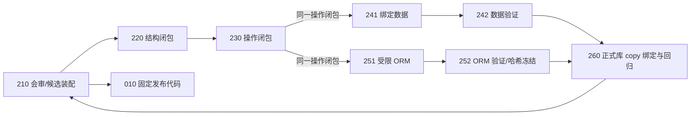
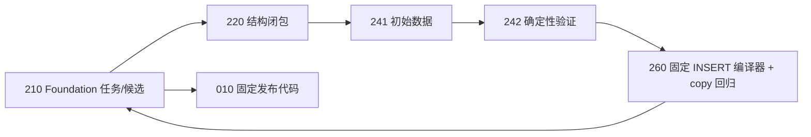

# V5 双通路与 Foundation 合同

本文件是 EAS-44 冻结的可读视图；机器权威入口为 `config/v5-architecture.json` 与 `config/v5-package-catalog.json`。旧 XLSX 与旧图仅保留为历史快照，不再解释现行运行链。

## 总体链路

非 Foundation 数据链为 `210 -> 220 -> 230 -> 241 -> 242 -> 260 -> 210 -> 010`；ORM 链为 `210 -> 220 -> 230 -> 251 -> 252 -> 260 -> 210 -> 010`。230 的同一份操作闭包必须同时可被 241 和 251 消费，禁止生成两套漂移语义。

## Foundation 链

Foundation 固定为 `210 -> 220 -> 241 -> 242 -> 260 -> 210 -> 010`，明确不调用 230/251/252，不使用 ORM、操作闭包或独立 ODS 资产。260 只能调用版本化的 `east-foundation-insert-compiler/v1`，生成参数化 INSERT 批次后在正式库 copy 中执行；编译器本身不连接数据库、不执行 SQL。

## 责任边界

- 241 负责生成或修改绑定业务数据。事件模式同时消费结构闭包、230 操作闭包和只读数据库快照；Foundation 模式消费任务画像、结构闭包、CA-V0.3.0、TRG-V1.0.0 与只读快照。
- 242 只验证单字段、表内多字段、跨表约束与顺序，不生成数据、不修改数据、不生成 INSERT。
- 251 只生成不含业务值的受限可执行 Python ORM。
- 252 只验证 AST/API、事务、哈希、dry-run 与执行顺序，并冻结 ORM 哈希；不承担独立 ODS 生成或验证。
- 260 只在数据库 copy 中绑定、执行、回滚测试与 SQL 回归；只有 010 的固定发布代码可提交正式库。

## 废止项与拒绝原则

字段生成器、字段策略器、表级装配器、旧 registry、独立 ODS 生成器和独立 ODS 验证器均不得进入 V5 运行时。Foundation 对 EVENT_OWNED 表、依赖缺失、环依赖、非法标识符、非标量绑定值和未知字段采取写前拒绝。
